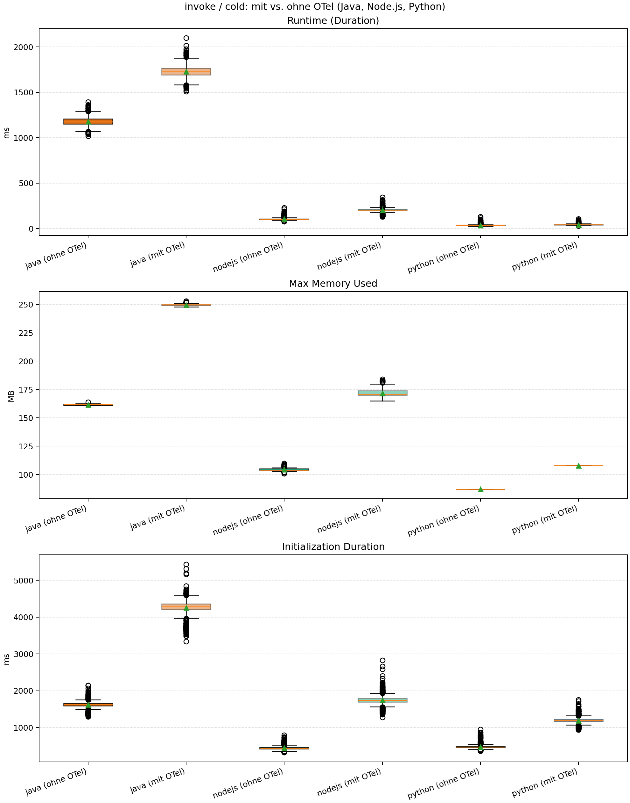
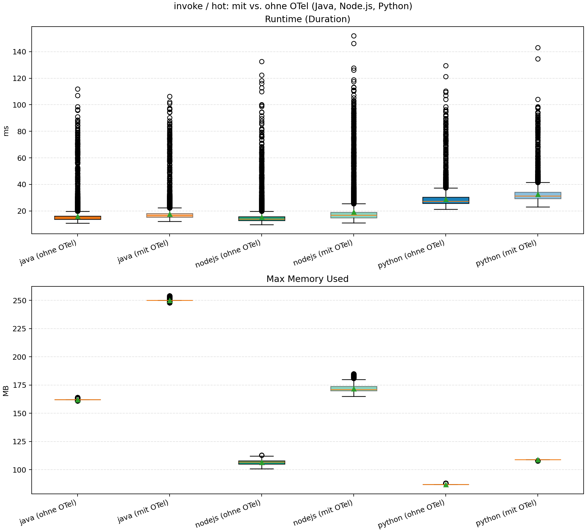
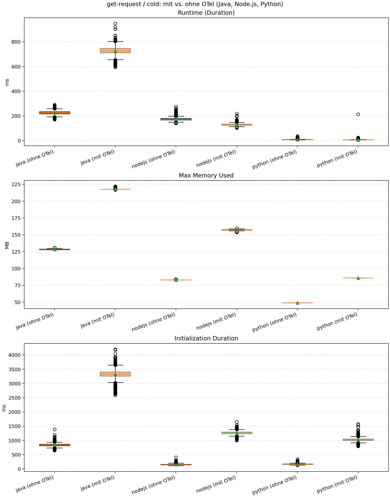
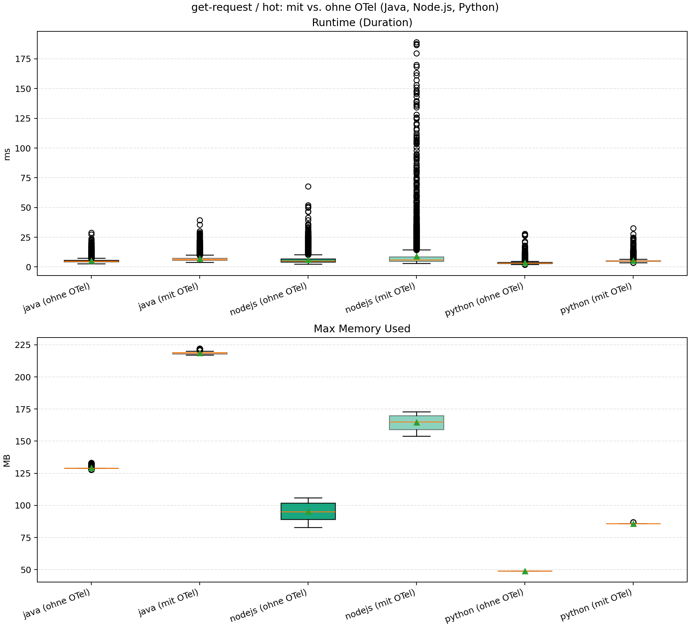
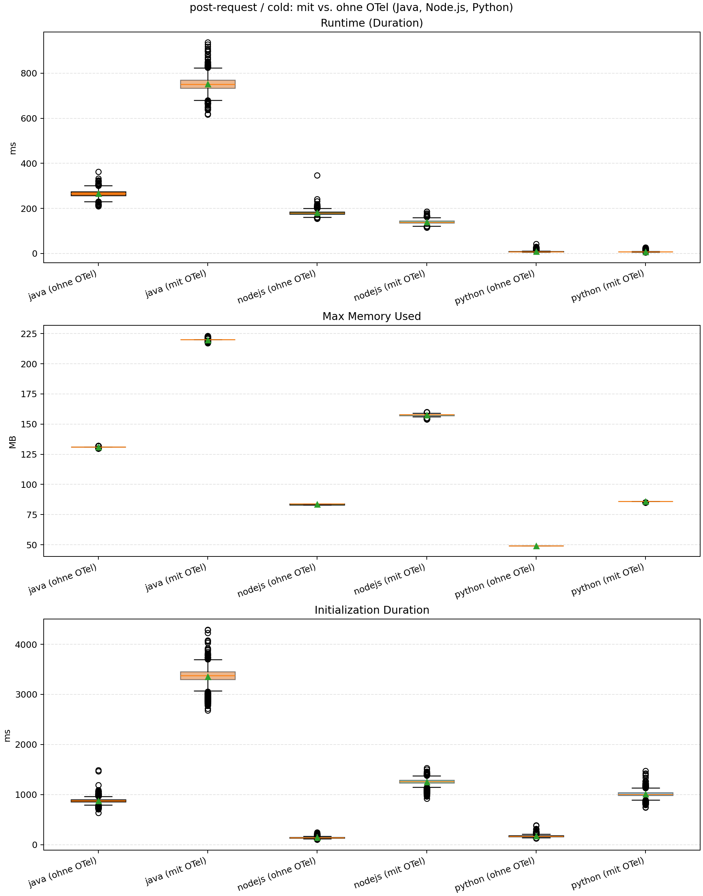
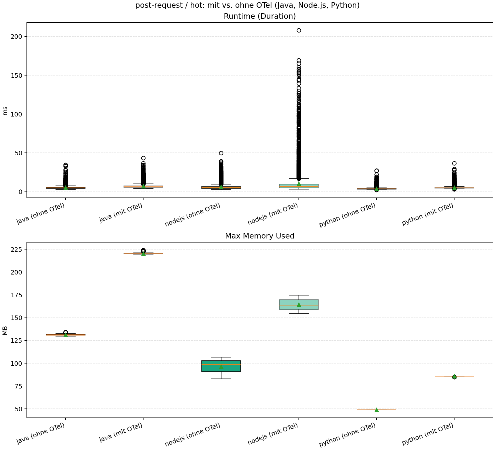
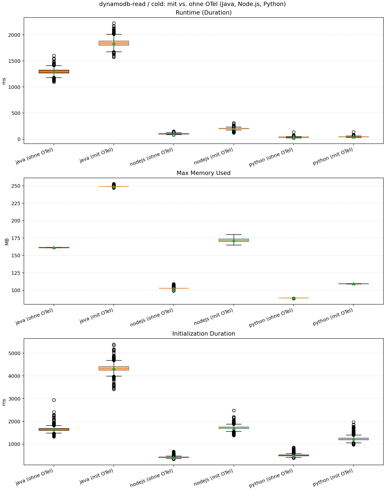
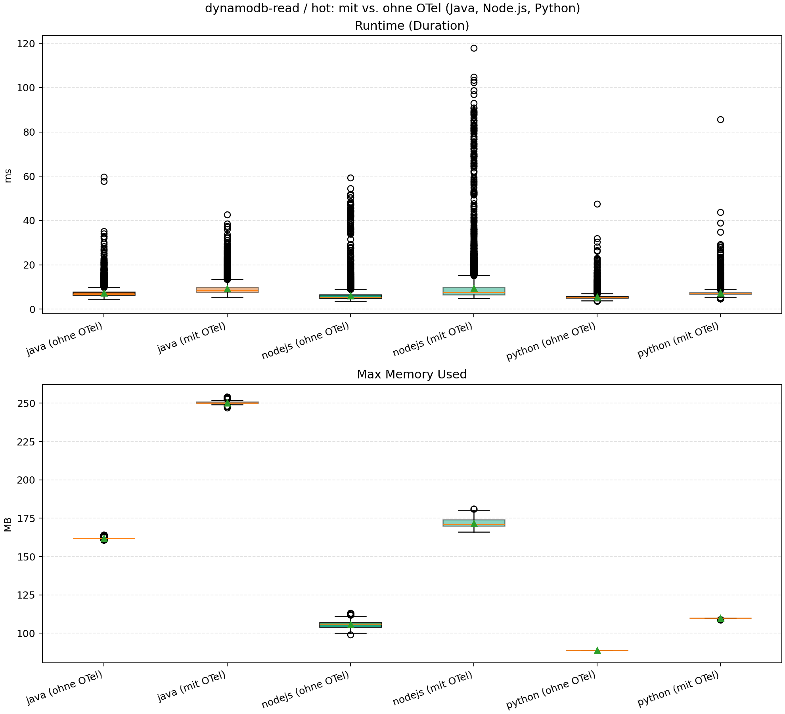
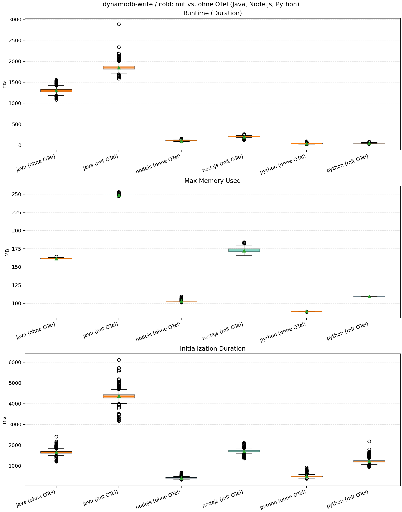
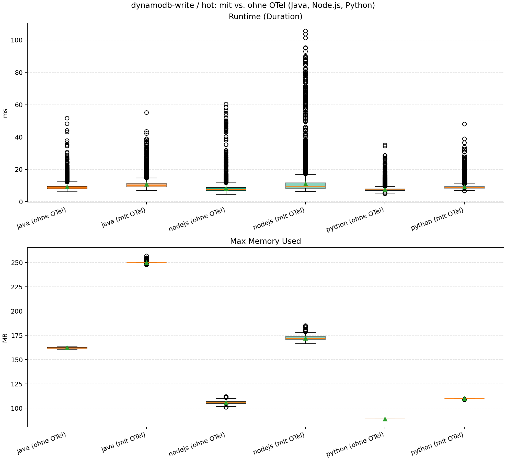

# OpenTelemetry Overhead in AWS Lambda (Java, Node.js, Python)

Dieses Repository begleitet eine Bachelorarbeit zur Bewertung des Overheads durch OpenTelemetry-Instrumentierung in AWS-Lambda-Workloads mit Java, Node.js und Python.

## Inhalt

- [Projektüberblick](#projektueberblick)
- [Microbenchmarks](#microbenchmarks)
- [Repository-Struktur](#repository-struktur)
- [Ordnerdokumentation](#ordnerdokumentation)
- [Ergebnisse](#ergebnisse)
```
.
├── [Ergebnisse](#ergebnisse)
├── _drafts
│   ├── begin-with-the-crazy-ideas. Textile
│   └── on-simplicity-in-technology. Markdown
├── _includes
│   ├── footer.html
│   └── header.html
├── _layouts
│   ├── default.html
│   └── post.html
├── _posts
│   ├── 2007-10-29-why-every-programmer-should-play-nethack.textile
│   └── 2009-04-26-barcamp-boston-4-roundup.textile
├── _data
│   └── members.yml
├── _site
└── index.html
```

## Projektueberblick

Untersucht werden Unterschiede zwischen nicht instrumentierten und instrumentierten Lambda-Funktionen in drei Sprachen und fünf Benchmark-Szenarien.
Alle Messungen wurden zwischen 02. März 2026 und 07. März 2026 durchgefürt.

Verglichene Metriken:

- Duration
- Init Duration
- Max Memory Used

## Microbenchmarks


Die Benchmarks decken folgende Zugriffsmuster ab:

1. Function Invocation (asynchrones Lambda-zu-Lambda)
2. HTTP GET Request
3. HTTP POST Request
4. AWS DynamoDB Read Operation
5. AWS DynamoDB Write Operation
<details><summary><b>Funktionsaufruf</b></summary>

Dieser Microbenchmark misst den Overhead, der entsteht, wenn eine AWS-Lambda-Funktion eine andere Lambda-Funktion asynchron aufruft (Fire-and-Forget).

Typischer Ablauf:

1. Funktion A sendet ein leichtgewichtiges Eingabe-Payload.
2. Funktion A ruft Funktion B asynchron auf.
3. Funktion A wartet nicht darauf, dass Funktion B abgeschlossen wird.
4. Funktion A kehrt unmittelbar zurück, nachdem der Aufruf gesendet wurde.

Was dadurch erfasst wird:

- Tracing-Overhead bei der Kommunikation zwischen Funktionen
- Overhead der Kontextweitergabe über Funktionsgrenzen hinweg
- Zusätzliche Latenz in kurzen Aufrufketten

</details>

<details><summary><b>HTTP-GET-Anfrage</b></summary>

Dieser Microbenchmark bewertet ausgehende, rein lesende HTTP-Kommunikation von einer Lambda-Funktion zu einem Endpunkt im AWS-basierten Testaufbau.

Typischer Ablauf:

1. Die Funktion sendet eine GET-Anfrage an einen festen Endpunkt.
2. Ein kleines Antwort-Payload wird zurückgegeben.
3. Die Funktion gibt die Antwort zurück.

Was dadurch erfasst wird:

- Tracing-Overhead für ausgehende Client-Spans
- Overhead durch Header-/Kontext-Injektion in Netzwerkanfragen
- Relativer Overhead bei einfacher, I/O-lastiger Logik

</details>

<details><summary><b>HTTP-POST-Anfrage</b></summary>

Dieser Microbenchmark bewertet ausgehende HTTP-Kommunikation mit Request-Body von einer Lambda-Funktion zu einem Endpunkt im AWS-basierten Testaufbau.

Typischer Ablauf:

1. Die Funktion erstellt ein kleines strukturiertes Payload.
2. Die Funktion sendet eine POST-Anfrage an einen festen Endpunkt.
3. Der Endpunkt gibt eine Antwort zurück, die von der Funktion ausgegeben wird.

Was dadurch erfasst wird:

- Tracing-Overhead für Request- und Response-Verarbeitung
- Serialisierungs- und Propagations-Overhead bei schreibenden API-Aufrufen
- Zusätzliche Instrumentierungskosten im Vergleich zu rein lesenden HTTP-Anfragen

</details>

<details><summary><b>AWS-DynamoDB-Leseoperation</b></summary>

Dieser Microbenchmark misst den Overhead beim Lesen eines einzelnen Datensatzes aus AWS DynamoDB.

Typischer Ablauf:

1. Die Funktion erstellt einen Suchschlüssel.
2. Die Funktion führt einen Einzel-Lesezugriff durch.
3. Das gelesene Element wird zurückgegeben.

Was dadurch erfasst wird:

- Tracing-Overhead bei Datastore-Client-Operationen (DynamoDB)
- Kontextweitergabe in Aufrufe der Speicherschicht
- Overhead-Charakteristik bei kurzen, lese-dominierten Datenzugriffen

</details>

<details><summary><b>AWS-DynamoDB-Schreiboperation</b></summary>

Dieser Microbenchmark misst den Overhead beim Schreiben eines einzelnen Datensatzes in AWS DynamoDB.

Typischer Ablauf:

1. Die Funktion erstellt einen kleinen Datensatz.
2. Die Funktion führt einen Einzel-Schreibzugriff durch.
3. Die Funktion gibt Erfolgsindikator zurück.

Was dadurch erfasst wird:

- Tracing-Overhead bei schreiborientierten Datastore-Aufrufen (DynamoDB)
- Instrumentierungskosten bei mutierenden Operationen
- Relative Overhead-Unterschiede zwischen Lese- und Schreibpfaden

</details>

Zusammen decken diese fünf Microbenchmarks Lambda-zu-Lambda-Aufrufe, ausgehenden HTTP-Verkehr und DynamoDB-Zugriffsmuster innerhalb von AWS ab. Dadurch entsteht eine kompakte, aber repräsentative Grundlage für den Vergleich von Tracing-Overhead über verschiedene Laufzeitumgebungen und Startmodi hinweg.
Jeder Benchmark wird als Baseline (ohne Tracing) und als instrumentierte Variante (mit Tracing) ausgefuehrt.

## Repository-Struktur

- `aws-http-server/`: Minimaler HTTP-Testserver für GET/POST-Benchmarks
- `aws-lambda-functions/`: Lambda-Implementierungen in Java, Node.js und Python
- `cloudwatch-logs/`: Exportierte Rohdaten (CSV) und Auswerte-Skripte
- `dynamo-db/`: Dokumentation der verwendeten DynamoDB-Tabellenstruktur
- `gfx/`: Grafiken für die Dokumentation
- `lambda-invocation-script/`: Last-/Invocation-Skript für den Lambda-Aufruf-Benchmark
- `results/`: Aufbereitete Ergebnisdateien und Visualisierungen

## Ordnerdokumentation

- [aws-http-server/readme.md](aws-http-server/readme.md)
- [aws-lambda-functions/readme.md](aws-lambda-functions/readme.md)
- [cloudwatch-logs/readme.md](cloudwatch-logs/readme.md)
- [dynamo-db/readme.md](dynamo-db/readme.md)
- [gfx/readme.md](gfx/readme.md)
- [lambda-invocation-script/readme.md](lambda-invocation-script/readme.md)
- [results/readme.md](results/readme.md)

## Ergebnisse
### Ranking der Overheads.
Es wurden Ranglisten basierend auf den relativen prozentualen Performanceveränderungen (Overheads) und den absoluten Messwerten erstellt. 
Dabei wurde verglichen wie oft jede Sprache den 1, 2. und 3. Platz belegt hat. Der kleinste Overhead in **%** oder der kleinste absolute Messwert - 
in **ms** bei **Duration** und **Init Duration** und in **MB** bei **Max Memory Used** bekommt den 1. Platz.
#### Rangliste prozentualer Overhead
| Kategorie        | Metrik           | Java (1./2./3.) | Node.js (1./2./3.) | Python (1./2./3.) |
|------------------|------------------|-----------------|--------------------|-------------------|
| **Kaltstarts**   | Init Duration    | 2 / 3 / 0       | 0 / 0 / 5          | 3 / 2 / 0         |
|                  | Duration         | 0 / 3 / 2       | 2 / 0 / 3          | 3 / 2 / 0         |
|                  | Max Memory       | 2 / 3 / 0       | 0 / 0 / 5          | 3 / 2 / 0         |
|                  | **Kombiniert (15)** | 4 / 9 / 2    | 2 / 0 / 13         | 9 / 6 / 0         |
| **Warmstarts**   | Duration         | 3 / 2 / 0       | 2 / 0 / 3          | 0 / 3 / 2         |
|                  | Max Memory       | 1 / 4 / 0       | 1 / 1 / 3          | 3 / 0 / 2         |
|                  | **Kombiniert(10)**                | 4 / 6 / 0       | 3 / 1 / 6          | 3 / 3 / 4         |
| **Kalt & Warm**  | –                | 8 / 15 / 2      | 5 / 1 / 19         | 12 / 9 / 4        |

#### Rangliste absolute Messwerte
| Kategorie        | Metrik             | Java (1./2./3.) | Node.js (1./2./3.) | Python (1./2./3.) |
|------------------|--------------------|-----------------|--------------------|-------------------|
| **Kaltstarts**   | Init Duration      | 0 / 0 / 5       | 0 / 5 / 0          | 5 / 0 / 0         |
|                  | Duration           | 0 / 0 / 5       | 0 / 5 / 0          | 5 / 0 / 0         |
|                  | Max Memory         | 0 / 0 / 5       | 0 / 5 / 0          | 5 / 0 / 0         |
|                  | **Kombiniert (15)** | 0 / 0 / 15     | 0 / 15 / 0         | 15 / 0 / 0        |
| **Warmstarts**   | Duration           | 1 / 1 / 3       | 0 / 4 / 1          | 4 / 0 / 1         |
|                  | Max Memory         | 0 / 0 / 5       | 0 / 5 / 0          | 5 / 0 / 0         |
|                  | **Kombiniert (10)**                  | 1 / 1 / 8       | 0 / 9 / 1          | 9 / 0 / 1         |
| **Kalt & Warm**  | –                  | 1 / 1 / 23      | 0 / 24 / 1         | 24 / 0 / 1        |
### Tabellarische Darstellung der absoluten Messwete und relativen Overheads in %
#### Kaltstarts
##### Duration
| Benchmark        | Sprache | Ohne OTel | Mit OTel | Overhead [KI] |
|------------------|---------|-----------|----------|---------------|
| dynamodb-read    | Java    | 1296,15   | 1840,74  | 41,99% [41,34;42,61] |
|                  | Node.js | 104,98    | 206,35   | 96,56% [94,61;98,23] |
|                  | Python  | 37,80     | 45,51    | 20,42% [18,07;22,64] |
| dynamodb-write   | Java    | 1302,57   | 1849,57  | 42,01% [41,38;42,62] |
|                  | Node.js | 108,74    | 208,50   | 91,67% [90,08;93,20] |
|                  | Python  | 41,65     | 48,78    | 17,06% [14,83;19,00] |
| get-request      | Java    | 227,12    | 728,44   | 220,70% [219,10;222,35] |
|                  | Node.js | 173,59    | 130,50   | -24,84% [-25,29;-24,35] |
|                  | Python  | 8,41      | 7,49     | -10,96% [-12,15;-9,78] |
| invoke           | Java    | 1177,85   | 1728,22  | 46,73% [46,18;47,33] |
|                  | Node.js | 104,20    | 206,22   | 97,98% [96,82;99,27] |
|                  | Python  | 36,67     | 43,59    | 18,88% [16,97;20,90] |
| post-request     | Java    | 267,25    | 751,27   | 181,18% [179,62;183,02] |
|                  | Node.js | 179,65    | 139,31   | -22,48% [-22,96;-21,99] |
|                  | Python  | 8,44      | 7,49     | -11,23% [-12,50;-10,07] |
##### Init Duration
| Benchmark        | Sprache | Ohne OTel | Mit OTel | Overhead [KI] |
|------------------|---------|-----------|----------|---------------|
| dynamodb-read    | Java    | 1644,62   | 4331,64  | 163,38% [162,12;164,64] |
|                  | Node.js | 419,62    | 1722,46  | 310,46% [308,03;312,78] |
|                  | Python  | 499,42    | 1221,04  | 144,54% [142,63;146,63] |
| dynamodb-write   | Java    | 1654,55   | 4350,58  | 162,90% [161,68;164,14] |
|                  | Node.js | 423,20    | 1722,29  | 306,86% [304,38;309,18] |
|                  | Python  | 499,06    | 1221,20  | 144,73% [142,85;146,93] |
| get-request      | Java    | 838,33    | 3334,48  | 297,77% [295,73;299,97] |
|                  | Node.js | 148,45    | 1268,26  | 754,13% [744,20;765,46] |
|                  | Python  | 169,76    | 1022,64  | 502,34% [497,71;507,06] |
| invoke           | Java    | 1623,17   | 4281,86  | 163,82% [162,67;164,92] |
|                  | Node.js | 436,50    | 1739,77  | 298,48% [295,18;301,23] |
|                  | Python  | 469,01    | 1189,14  | 153,56% [151,95;155,55] |
| post-request     | Java    | 877,13    | 3372,64  | 284,51% [282,69;286,05] |
|                  | Node.js | 139,51    | 1262,88  | 805,21% [798,92;812,44] |
|                  | Python  | 169,06    | 1007,19  | 495,87% [490,38;501,25] |
##### Max Memory Used
| Benchmark        | Sprache | Ohne OTel | Mit OTel | Overhead [KI] |
|------------------|---------|-----------|----------|---------------|
| dynamodb-read    | Java    | 162       | 249      | 53,70% [53,70;53,70] |
|                  | Node.js | 103       | 171      | 66,02% [66,02;66,02] |
|                  | Python  | 89        | 110      | 23,60% [23,60;23,60] |
| dynamodb-write   | Java    | 162       | 249      | 53,70% [53,70;53,70] |
|                  | Node.js | 103       | 172      | 66,99% [66,99;66,99] |
|                  | Python  | 89        | 110      | 23,60% [23,60;23,60] |
| get-request      | Java    | 129       | 218      | 68,99% [68,99;68,99] |
|                  | Node.js | 83        | 157      | 89,16% [89,16;90,36] |
|                  | Python  | 49        | 86       | 75,51% [75,51;75,51] |
| invoke           | Java    | 162       | 250      | 54,32% [53,70;54,32] |
|                  | Node.js | 104       | 171      | 64,42% [64,42;64,42] |
|                  | Python  | 87        | 108      | 24,14% [24,14;24,14] |
| post-request     | Java    | 131       | 220      | 67,94% [67,94;67,94] |
|                  | Node.js | 84        | 158      | 88,10% [88,10;88,10] |
|                  | Python  | 49        | 86       | 75,51% [75,51;75,51] |
#### Warmstarts
##### Duration
| Benchmark        | Sprache | Ohne OTel | Mit OTel | Overhead [KI] |
|------------------|---------|-----------|----------|---------------|
| dynamodb-read    | Java    | 6,86      | 8,41     | 22,48% [21,13;23,87] |
|                  | Node.js | 5,43      | 7,61     | 40,22% [37,50;42,99] |
|                  | Python  | 5,39      | 7,08     | 31,30% [30,44;32,05] |
| dynamodb-write   | Java    | 8,66      | 10,01    | 15,55% [14,48;16,61] |
|                  | Node.js | 7,59      | 9,37     | 23,45% [21,65;25,15] |
|                  | Python  | 7,42      | 8,94     | 20,49% [19,76;21,08] |
| get-request      | Java    | 4,89      | 6,38     | 30,47% [29,07;31,75] |
|                  | Node.js | 5,12      | 6,03     | 17,77% [14,11;20,98] |
|                  | Python  | 3,47      | 5,03     | 44,96% [43,84;45,95] |
| invoke           | Java    | 14,77     | 16,51    | 11,80% [11,00;12,64] |
|                  | Node.js | 14,01     | 16,71    | 19,30% [18,04;20,60] |
|                  | Python  | 27,37     | 31,24    | 14,13% [13,34;14,94] |
| post-request     | Java    | 4,95      | 6,38     | 28,95% [27,71;30,28] |
|                  | Node.js | 5,23      | 6,47     | 23,89% [20,38;28,09] |
|                  | Python  | 3,58      | 5,05     | 41,34% [40,28;42,42] |
##### Max Memory Used
| Benchmark        | Sprache | Ohne OTel | Mit OTel | Overhead [KI] |
|------------------|---------|-----------|----------|---------------|
| dynamodb-read    | Java    | 162       | 250      | 54,32% [54,32;54,32] |
|                  | Node.js | 106       | 171      | 61,32% [61,32;61,32] |
|                  | Python  | 89        | 110      | 23,60% [23,60;23,60] |
| dynamodb-write   | Java    | 162       | 250      | 54,32% [54,32;54,32] |
|                  | Node.js | 106       | 172      | 62,26% [62,26;62,26] |
|                  | Python  | 89        | 110      | 23,60% [23,60;23,60] |
| get-request      | Java    | 129       | 219      | 69,77% [69,77;69,77] |
|                  | Node.js | 95        | 165      | 72,63% [70,83;74,74] |
|                  | Python  | 49        | 86       | 75,51% [75,51;75,51] |
| invoke           | Java    | 162       | 250      | 54,32% [54,32;54,32] |
|                  | Node.js | 107       | 171      | 59,81% [59,81;59,81] |
|                  | Python  | 87        | 109      | 25,29% [25,29;25,29] |
| post-request     | Java    | 131       | 220      | 67,94% [67,94;67,94] |
|                  | Node.js | 99        | 164      | 65,66% [63,00;67,35] |
|                  | Python  | 49        | 86       | 75,51% [75,51;75,51] |
### Graphische Darstellung der Messergebnisse
#### Lambda-Funktionsaufruf
##### Kaltstarts


##### Warmstarts


#### HTTP-GET-Anfrage
##### Kaltstarts


##### Warmstarts


#### HTTP-POST-Anfrage
##### Kaltstarts


##### Warmstarts


#### AWS-DynamoDB-Leseoperation
##### Kaltstarts


##### Warmstarts


#### AWS-DynamoDB-Schreiboperation
##### Kaltstarts


##### Warmstarts

