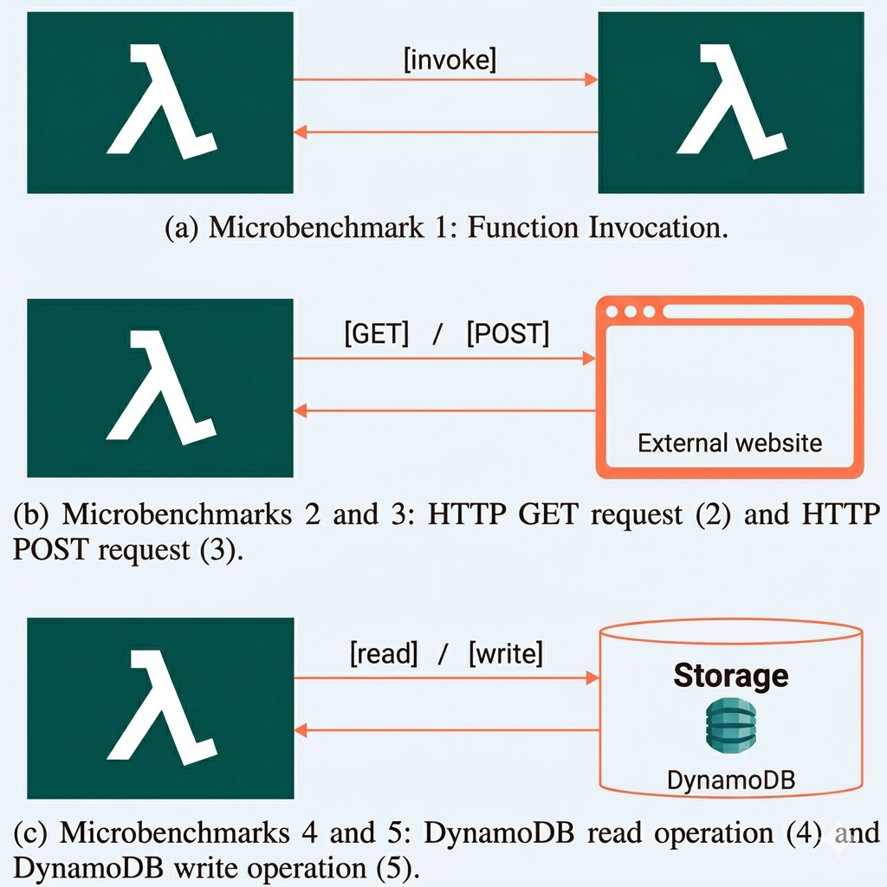

# OpenTelemetry Overhead in AWS Lambda (Java, Node.js, Python)

Dieses Repository begleitet eine Bachelorarbeit zur Bewertung des Overheads durch OpenTelemetry-Instrumentierung in AWS-Lambda-Workloads mit Java, Node.js und Python.

## Inhalt

- [Projektüberblick](#projektueberblick)
- [Microbenchmarks](#microbenchmarks)
- [Repository-Struktur](#repository-struktur)
- [Ordnerdokumentation](#ordnerdokumentation)

## Projektueberblick

Untersucht werden Unterschiede zwischen nicht instrumentierten und instrumentierten Lambda-Funktionen in drei Sprachen und fünf Benchmark-Szenarien.
Alle Messungen wurden zwischen 02. März 2026 und 07. März 2026 durchgefürt.

Verglichene Metriken:

- Duration
- Init Duration
- Max Memory Used

## Microbenchmarks

Die Benchmarks decken folgende Zugriffsmuster ab:

1. Function Invocation (asynchrones Lambda-zu-Lambda)
2. HTTP GET Request
3. HTTP POST Request
4. AWS DynamoDB Read Operation
5. AWS DynamoDB Write Operation

<b>Funktionsaufruf</b>

Dieser Microbenchmark misst den Overhead, der entsteht, wenn eine AWS-Lambda-Funktion eine andere Lambda-Funktion asynchron aufruft (Fire-and-Forget).

Typischer Ablauf:

1. Funktion A sendet ein leichtgewichtiges Eingabe-Payload.
2. Funktion A ruft Funktion B asynchron auf.
3. Funktion A wartet nicht darauf, dass Funktion B abgeschlossen wird.
4. Funktion A kehrt unmittelbar zurück, nachdem der Aufruf gesendet wurde.

Was dadurch erfasst wird:

- Tracing-Overhead bei der Kommunikation zwischen Funktionen
- Overhead der Kontextweitergabe über Funktionsgrenzen hinweg
- Zusätzliche Latenz in kurzen Aufrufketten

<b>HTTP-GET-Anfrage</b>

Dieser Microbenchmark bewertet ausgehende, rein lesende HTTP-Kommunikation von einer Lambda-Funktion zu einem Endpunkt im AWS-basierten Testaufbau.

Typischer Ablauf:

1. Die Funktion sendet eine GET-Anfrage an einen festen Endpunkt.
2. Ein kleines Antwort-Payload wird zurückgegeben.
3. Die Funktion gibt die Antwort zurück.

Was dadurch erfasst wird:

- Tracing-Overhead für ausgehende Client-Spans
- Overhead durch Header-/Kontext-Injektion in Netzwerkanfragen
- Relativer Overhead bei einfacher, I/O-lastiger Logik

<b>HTTP-POST-Anfrage</b>

Dieser Microbenchmark bewertet ausgehende HTTP-Kommunikation mit Request-Body von einer Lambda-Funktion zu einem Endpunkt im AWS-basierten Testaufbau.

Typischer Ablauf:

1. Die Funktion erstellt ein kleines strukturiertes Payload.
2. Die Funktion sendet eine POST-Anfrage an einen festen Endpunkt.
3. Der Endpunkt gibt eine Antwort zurück, die von der Funktion ausgegeben wird.

Was dadurch erfasst wird:

- Tracing-Overhead für Request- und Response-Verarbeitung
- Serialisierungs- und Propagations-Overhead bei schreibenden API-Aufrufen
- Zusätzliche Instrumentierungskosten im Vergleich zu rein lesenden HTTP-Anfragen

<b>AWS-DynamoDB-Leseoperation</b>

Dieser Microbenchmark misst den Overhead beim Lesen eines einzelnen Datensatzes aus AWS DynamoDB.

Typischer Ablauf:

1. Die Funktion erstellt einen Suchschlüssel.
2. Die Funktion führt einen Einzel-Lesezugriff durch.
3. Das gelesene Element wird zurückgegeben.

Was dadurch erfasst wird:

- Tracing-Overhead bei Datastore-Client-Operationen (DynamoDB)
- Kontextweitergabe in Aufrufe der Speicherschicht
- Overhead-Charakteristik bei kurzen, lese-dominierten Datenzugriffen

<b>AWS-DynamoDB-Schreiboperation</b>

Dieser Microbenchmark misst den Overhead beim Schreiben eines einzelnen Datensatzes in AWS DynamoDB.

Typischer Ablauf:

1. Die Funktion erstellt einen kleinen Datensatz.
2. Die Funktion führt einen Einzel-Schreibzugriff durch.
3. Die Funktion gibt Erfolgsindikator zurück.

Was dadurch erfasst wird:

- Tracing-Overhead bei schreiborientierten Datastore-Aufrufen (DynamoDB)
- Instrumentierungskosten bei mutierenden Operationen
- Relative Overhead-Unterschiede zwischen Lese- und Schreibpfaden

Zusammen decken diese fünf Microbenchmarks Lambda-zu-Lambda-Aufrufe, ausgehenden HTTP-Verkehr und DynamoDB-Zugriffsmuster innerhalb von AWS ab. Dadurch entsteht eine kompakte, aber repräsentative Grundlage für den Vergleich von Tracing-Overhead über verschiedene Laufzeitumgebungen und Startmodi hinweg.
Jeder Benchmark wird als Baseline (ohne Tracing) und als instrumentierte Variante (mit Tracing) ausgefuehrt.

## Repository-Struktur

- `aws-http-server/`: Minimaler HTTP-Testserver für GET/POST-Benchmarks
- `aws-lambda-functions/`: Lambda-Implementierungen in Java, Node.js und Python
- `cloudwatch-logs/`: Exportierte Rohdaten (CSV) und Auswerte-Skripte
- `dynamo-db/`: Dokumentation der verwendeten DynamoDB-Tabellenstruktur
- `gfx/`: Grafiken für die Dokumentation
- `lambda-invocation-script/`: Last-/Invocation-Skript für den Lambda-Aufruf-Benchmark
- `results/`: Aufbereitete Ergebnisdateien und Visualisierungen

## Ordnerdokumentation

- [aws-http-server/readme.md](aws-http-server/readme.md)
- [aws-lambda-functions/readme.md](aws-lambda-functions/readme.md)
- [cloudwatch-logs/readme.md](cloudwatch-logs/readme.md)
- [dynamo-db/readme.md](dynamo-db/readme.md)
- [gfx/readme.md](gfx/readme.md)
- [lambda-invocation-script/readme.md](lambda-invocation-script/readme.md)
- [results/readme.md](results/readme.md)
